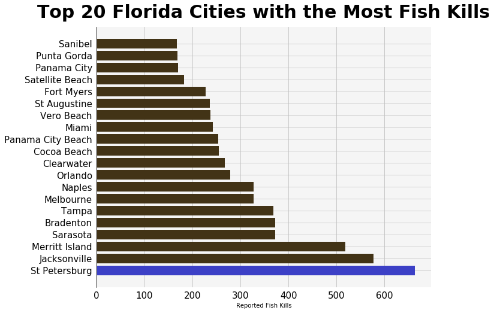
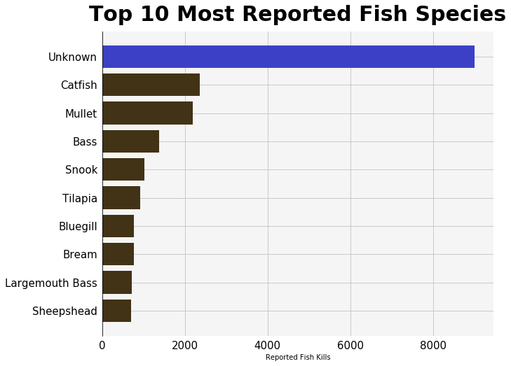
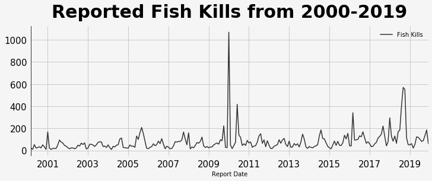
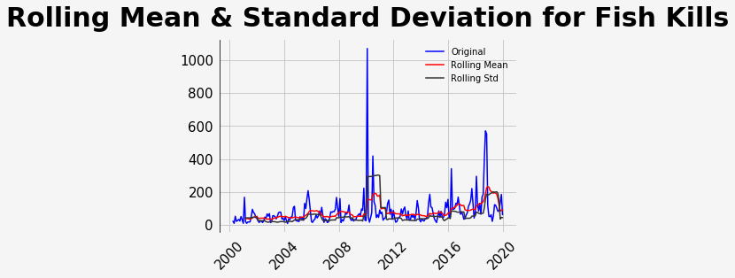
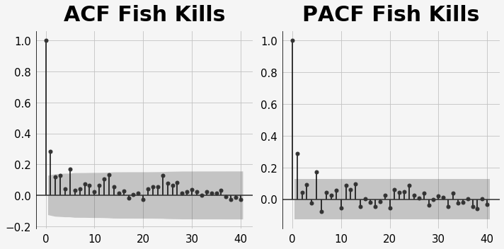
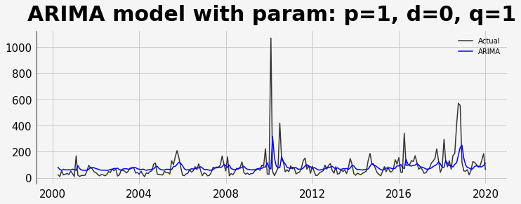
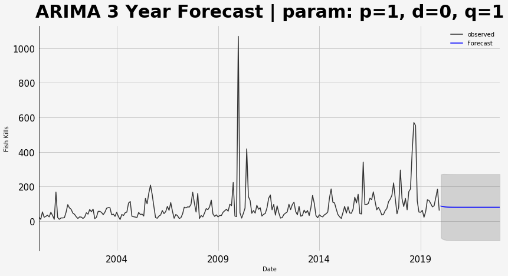
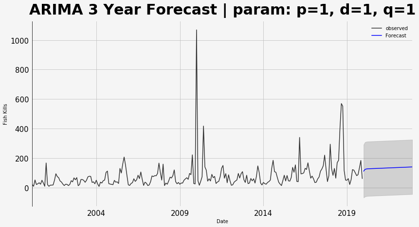
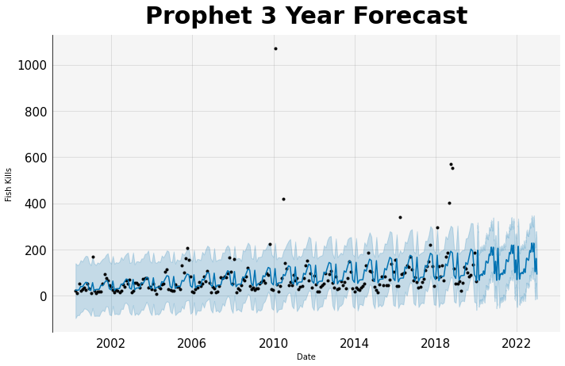

# Forecasting the effects (fish kills) of Red Tide and Algal Blooms in Florida

## Introduction

Every year, Florida experiences Algal blooms throughout the various bodies of water in the state as a result of excess nutrient concentrations in the water. These algal blooms are extremely lethal as they kill thousands of fish and can cause health issues for humans. One particular algal bloom that is most prevalent in Florida is the Red Tide. The Florida red tide refers to the process by which high concentrations of the Algae Karenia brevis become present, creating toxins that have immense consequences for animal and human well being. Each year, Florida witnesses massive fish killings across the coast resulting in millions of lost dollars for Florida's fishing and tourism industries. Even more important, the red tide poses a great danger to human health as the toxins produced can cause serious respiratory illnesses to people who inhale them.

**The goal of this project was to forecast the quantity of future fish kills in Florida as a result of Algal blooms, such as the Red Tide, in order to understand the magnitude of this problem.**

## Project Outline

The framework of this project can be divided into 5 parts.

1. Generate a data report from the Florida Fish and Wildlife Conservation Commission on reported fish kills in Florida from the years 2000-2020.
2. Perform Exploratory Data Analysis to better understand the data and visualize the time series aspect of the data.
3. Stationarize the data to be used by the time series model
4. Plot Auto Correlation Function and Partial Auto Correlation Plots to understand the parameters of the ARIMA model.
5. Test Models and Forecast Fish Kills:
   - ARIMA
   - Facebook Prophet

## Exploratory Data Analysis and Visualize the Data

After generating the data report, the first step was to explore the data. In particular I had three questions that I was eager to explore. The questions are resulting charts are displayed below.

| Which Florida cities have witnessed the most fish kills?     | Which fish species have been reported the most?        | How have the number of reported fish kills changed over time? |
| ------------------------------------------------------------ | ------------------------------------------------------ | ------------------------------------------------------------ |
|  |  |      |

Takeaways:

- As expected, all the top 20 cities with the most reported fish kills are located in close proximity with large bodies of water in Florida. St Petersburg tops the list with the most reported fish kills, followed by Jacksonville.
- I found it interesting to see how in the majority of reported fish kills the species reported is unknown by the reporter. Additionally, it appears that Catfish and Mullet have been affected the most by the recent algal blooms as their species have been reported the most.
- The quantity of reported fish kills has remained relatively steady throughout the past two decades with a sudden average increase beginning in the year 2015. Additionally, 2010 appears to have witnessed an unprecedented number of fish kills and therefore must have been a year with historical algal blooms. The next massive peak occurs in the year 2018. A quick google search and I found an article by the NOAA stating "An unusually persistent harmful algal bloom (red tide) affected portions of the coasts of Florida between 2017-2018"

## Stationarize Data

Most statistical forecasting methods are based on the assumption that the time series data is approximately stationary (constant mean, constant variance, autocovariance does not depend on time). To test for stationarity I used the an augmented version of the Dickey-Fuller test.

After performing the test I obtained a p-value less than 0.05 confirming that the data is indeed already stationary. If the p-value was greater than 0.05 then I would need to correct for stationarity using techniques such as transforming, smoothing, differencing, polynomial fitting and decomposition.

## Plot ACF and PACF

The parameters for an ARIMA model are as follows:

- p (Number of Auto Regressive terms) Seasonality
- d (Number of Integrated or Difference terms) Trend
- q (Number of Moving Average Terms) Noise

In order to find the parameters to feed into the ARIMA model we can use ACF (Autocorrelation function) and PACF (Partial Autocorrelation Function) plots. ACF shows the correlation between the current observations and the observations at previous time spots. PACF still measures the correlation between two observations but also considers the effect that other observations may have on those two observations.

The above two plots show the Auto correlation function and partial auto correlation function for the time series data. The points that are above the gray area in the graph are considered as points that are statistically significant. Since both the ACF and PACF plots have only three statistically significant points, both the ACF and PACF follow a geometric series and therefore the ARMA model would be the best fit.

## Test Models and Forecast

**ARIMA:** Autoregressive Integrated Moving Average

ARIMA models take in three parameters:
- p (Number of Auto Regressive terms) Seasonality
- d (Number of Integrated or Difference terms) Trend
- q (Number of Moving Average Terms) Noise

In order to find the most optimal combination of p, d, and q for the ARIMA model I performed a grid search and compared the root mean squared error for each model. Based on the grid search I found the best parameters to be p = 1, d = 0, and q = 1. Next, I tested the model against the actual observations and then performed a three year forecast.

| ARIMA model testing                                  | ARIMA model forecasting without seasonality              | ARIMA model forecasting with seasonality                     |
| ---------------------------------------------------- | -------------------------------------------------------- | ------------------------------------------------------------ |
|  |  |  |

As we can see from the two graphs above, accounting for seasonality greatly affects the three-year forecast. The top graph, not accounting for seasonality, projects that reported fish kills will remain at the average which is promising news. On the other hand, the bottom graph which accounts for seasonality projects that the reported fish kills will increase in the next three years which is very disappointing news. 

**Prophet:** Facebook's additive forecasting model

Interestingly enough, the Prophet Model produced a root mean squared error of 87.6, thereby outperforming the ARIMA model (RMSE- 93). Additionally, the Prophet model appears to be more robust to outliers and is able to better understand the trends in the data. Similar to the ARIMA model that accounted for seasonality, the Prophet Model projects that Fish Kills will continue to increase in the upcoming years, proving the importance of this issue.

## Conclusion + Future Considerations

Based on the models tested and forecasted, reported fish kills are projected to increase in the upcoming years. This highlights how environmental solutions are needed to address the growing risks associated with algal blooms and the red tide. While the issue hasn't garnered enough attention in recent years, I hope that individuals and communities in Florida will become increasingly conscious of this issue and begin to find ways to address this grand issue.

Overall this project was a great learning experience for me as I got to experiment with time-series data and learn about some industry methods for handling the data as well as forecasting. In the future I wish to also learn how to use more complicated time series models such as Long short-term models as well as convolutional neural networks.

### References

PyData Conference- https://www.youtube.com/watch?v=JntA9XaTebs&t=4074s

Machine Learning Mastery- https://machinelearningmastery.com/how-to-develop-lstm-models-for-time-series-forecasting/

Analytics Vidhya- https://www.analyticsvidhya.com/blog/2016/02/time-series-forecasting-codes-python/

